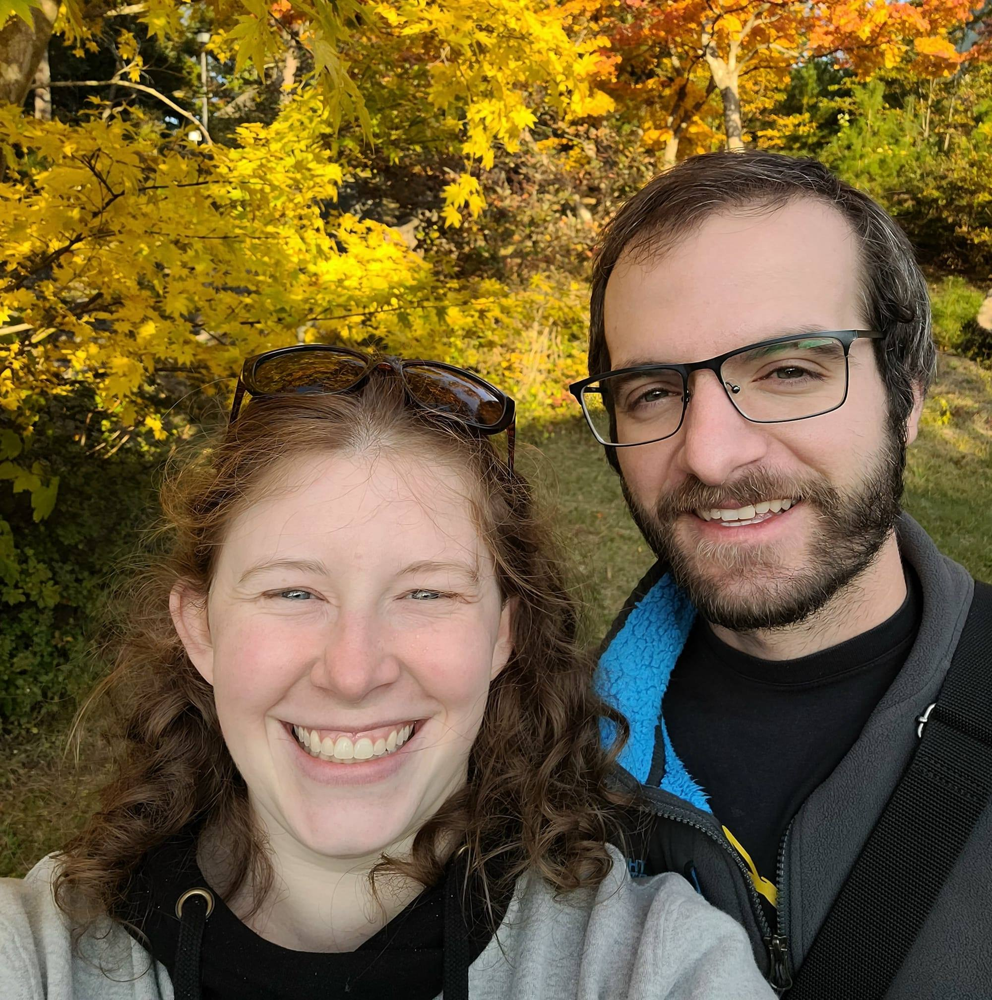
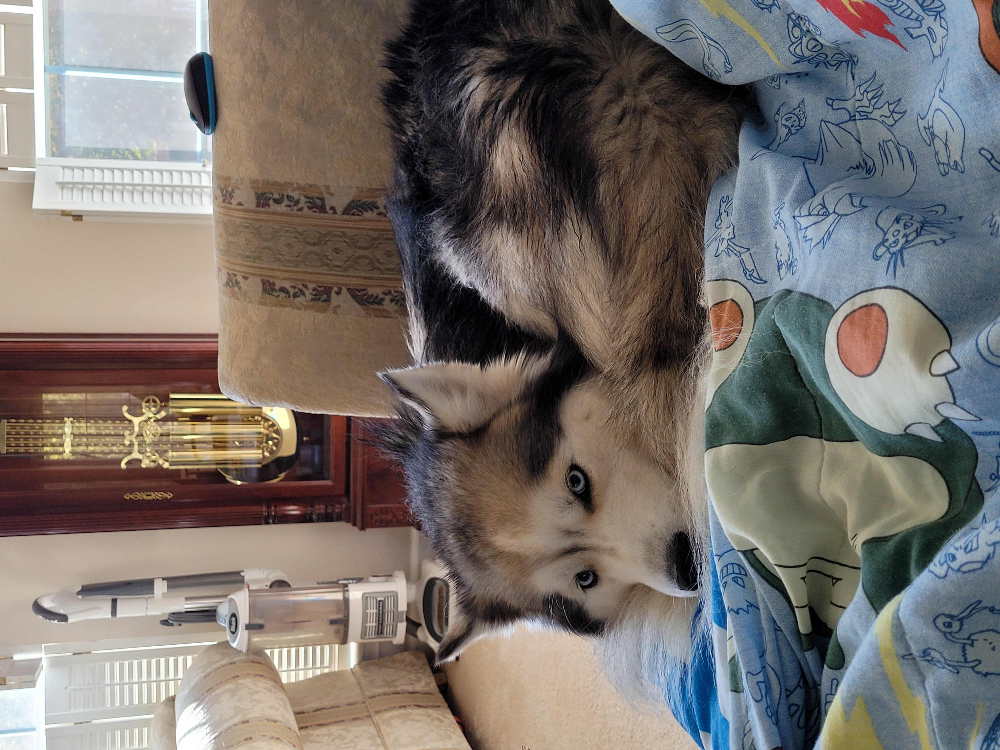

# About Jaye Lasseigne

- From **_Greenville, SC_**
- My favorite food is okonomiyaki! It's usually translated as 'Japanese pizza.'
- I like to bullet journal!
  

 I chose DC mostly because it is smaller than other bootcamps. I also liked their syllabus! 

 Before this bootcamp, I taught English in Japan for five years (July 2017 -- July 2022). I lived in northern Nagano Prefecture, home to snow monkeys and lots of rice fields. 

 My dad has a fluffy dog named Nikkita! I am obsessed with him.

- 
