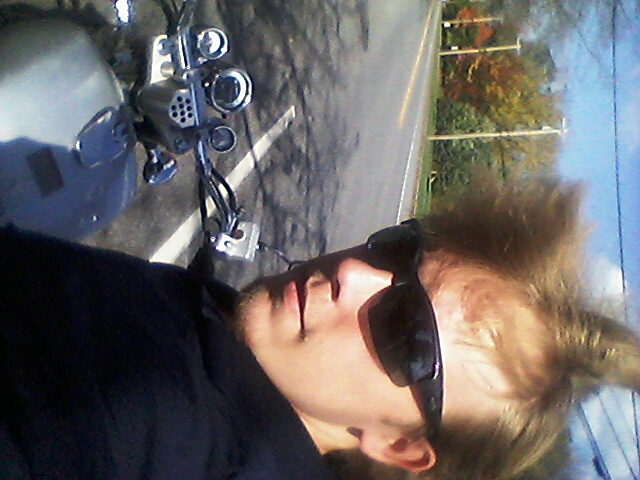

Home town; ***Marietta Georgia***

Favorite food; Anything Ketosis friendly

Contact; SoftwareKengineer@gmail.com

Fun fact; I worked as a industrial watertreatment 
technologist as my last career

I met someone online and she mentioned how much she likes working remote and how great DigitalCrafts is at helping learn how to become a software engineer so made the investment to join so I could speed up my learning/ getting hired.

